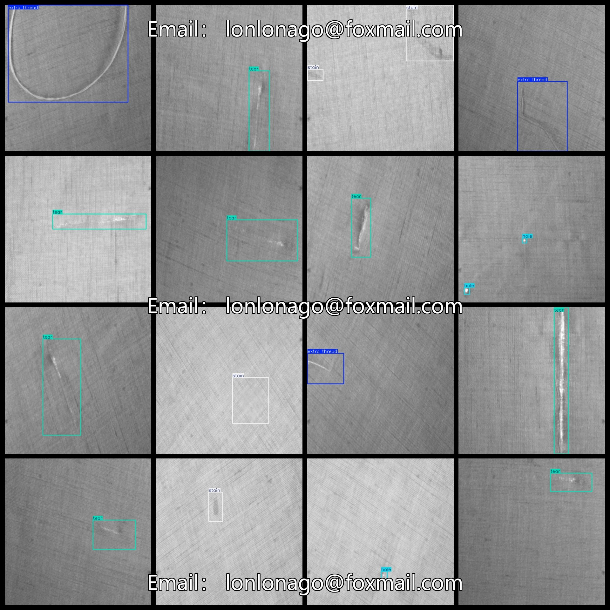

# Fabric Defect Dataset 757 imagesVOC+YOLO format

The defective fabric dataset contains 757 images in the VOC+YOLO format.

Dataset format: Pascal VOC format + YOLO format (the txt file does not contain the split path, it only contains jpg images and corresponding VOC format xml files and yolo format txt files)

Number of images (number of jpg files): 757

Number of annotations (number of xml files): 757

Number of annotations (number of txt files): 757

Number of annotated categories: 4

The Github repository is: datasets_sl

["extra thread", "hole", "stain", "tear"]

Unnecessary lines, holes, stains, tears

Number of boxes labeled in each category:

The number of extra threads is 96.

Number of holes = 174

Stain Frame Count = 266

Tear Frames = 324

Total frame count: 860

Number of images per category:

The number of extra threads occupied by the image = 96.

Hole occupancy image count = 154

Staining of image count = 241

The number of photos owned = 300

Image resolution: 640x640

Use the labeling tool: labelImg

Dataset Augmentation: No

Rules for annotation: Draw a rectangle around the category.

Important note: The dataset does not have been divided into training, validation, and testing sets.

Special Disclaimer: This dataset does not guarantee the accuracy of the trained models or weight files.

Annotation and image details are as follows:

## Images

---

Here is a pay link on Stripe (https://buy.stripe.com/3cs8yP7sY87d0vu9AB). Please contact me lonlonago@foxmail.com after funding $89, and I will send you a complete data files, thank you!

